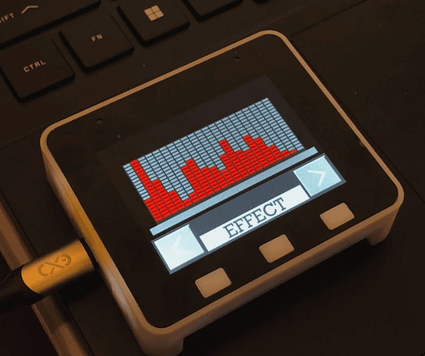

# Audio Spectrum Display using ESP32S3 Box Lite

<p align="center">
  
</p>


This is continuation of the [Audio Spectrum Display](https://github.com/Gieneq/Audio-Spectrum-Display), now utilizing the ESP32S3 Box Lite. It can visualize audio spectrum effects on the built-in display and drive a WS2812B LED matrix.

## Features
- Real-time audio spectrum visualization
- Built-in display and WS2812B LED matrix support
- FFT-based processing for accurate audio representation
- Compatible with ESP32S3 Box Lite

## Requirements

Running project requires:
- VS Code
- [ESP-ID extension](https://marketplace.visualstudio.com/items?itemName=espressif.esp-idf-extension)
- ESP-IDF >5.0

## Installation & Setup

Clone the repository:
```sh
git clone https://github.com/Gieneq/Audio-Spectrum-Display-ESP32S3.git
cd Audio-Spectrum-Display-ESP32S3
```
Open the project in VS Code. Ensure the ESP-IDF extension is installed and configured. Select the ESP32S3 target and upload option. Finally build and flash the project using the icons on the VS Code Status Bar.

## Usage

Once flashed, the ESP32S3 Box Lite will display the audio spectrum in real-time.

The WS2812B LED matrix synchronizes with the audio input, creating vibrant visual effects.

[Python script](tools/bins_gen.py) is used to generate bins. The bins are used to equalize bars by adding samples so that overall strenght remains equal.

So far the device only uses builtin microphone. Soon it will be able to be connected to audio jack.

// todo
https://github.com/espressif/esp-box/blob/master/hardware/esp32_s3_box_lite_MB_V1.1/schematic/SCH_ESP32-S3-BOX-Lite_MB_V1.1_20211221.pdf

Note! Set ADC2 continuous mode enabled despite errata warning 'CONFIG_ADC_CONTINUOUS_FORCE_USE_ADC2_ON_C3_S3'

## License

This project is licensed under the MIT License.